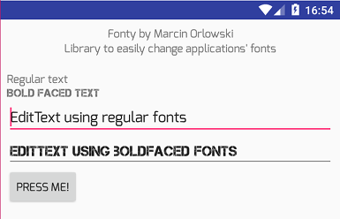

Fonty
=====

 
 

 `Fonty` is simple Android library allowing you to easily change the typeface
 of your UI elements. Contrary to other implementations `Fonty` is designed with
 the assumption that if you want to change the font for your  app, then you change
 it **globally** per whole application, to achieve consistency across your Fragments
 or Activities.

 Using `Fonty` requires **no change** to be made to your layout files and
 all you need to do is to initialize the library and specify what typeface
 you want to be used as regular and boldfaced ones. That's it.

 

 Download demo application APK from [releases section](https://github.com/MarcinOrlowski/fonty/releases).
 Source code in project's [app/](https://github.com/MarcinOrlowski/fonty/tree/master/app/src/main) module.

Features
========

 - Fast and lightweight
 - Simple API
 - Supports the following UI elements and its subclasses:
   * TextInputLayout (see [notes](#textinputlayout) below!)
   * TextView
   * EditText
   * Button
 - Handles navigation menu items
 - Can be used in libraries

Installation
============

 Edit your master `gradle.build` file and **add** `maven { url 'https://jitpack.io' }` to your current
 `repositories` block content (if you use other jitpack hosted libraries, then this step can be skipped):

    allprojects {
      repositories {
        maven { url 'https://jitpack.io' }
        }
    }

 Next, edit your **module**'s `build.gradle` and the following dependency:

    compile 'com.github.MarcinOrlowski:fonty:<VERSION>'

 For right value of `<VERSION>` consult [release section](https://github.com/MarcinOrlowski/fonty/releases)
 or see [jitpack page](https://jitpack.io/#MarcinOrlowski/fonty).

Configuration
=============

 Put your [TrueType](https://en.wikipedia.org/wiki/TrueType) font files into module's `asset/fonts`
 folder (`<MODULE>/src/main/assets/fonts` folder, where `<MODULE>` usually equals `app`).

 Then add the following lines to your custom Application's class' `onCreate()`
 method (if you do not use own `Application` subclass, see demo app for how
 to make one and how it should be referenced form your `AndroidManifest.xml` file):

    Fonty
        .context(this)
	    .regularTypeface("Xenotron.ttf")
	    .italicTypeface("Carramba.ttf")
        .boldTypeface("XPED.ttf")
        .done();

 The above sets up `Xenotron.ttf` to be used whenever regular font should be rendered
 and `XPED.ttf` to be used if your UI elements sets `android:textStyle="bold"` attribute and
 `Carramba.ttf` for `android:textStyle="italic"`.

 If you prefer to have font files stored elsewhere than in assets' `fonts/` subfolder use `fontDir()`
 in your builder chain:

    Fonty
        .context(this)
        .fontDir("my-fonts")
	    .regularTypeface("Xenotron.ttf")
	    .italicTypeface("Carramba.ttf")
        .boldTypeface("XPED.ttf")
        .done();

 and put your font files into `<MODULE>/src/main/assets/my-fonts` folder.

 **NOTE: ** You MUST call `fontDir()` **before** invoking `xxxTypeface()` in your setup chain,
 otherwise `xxxTypeface()` with try to look for fonts in default location and most likely end
 up throwing exception due to missing typeface file.

Font substitution
=================

 This sets up font substitution but we yet need to apply fonts to widgets.

 For `Activity` add this as last entry in your `onCreate()`:

    Fonty.setFonts(this);

 Same for `Fragments`, add the following to your `onCreateView()`:

     Fonty.setfonts(view);

 where `view` is the `View` is what you just inflated.

 Using it with `RecyclerView` is also pretty simple. Edit your `onCreateViewHolder()` and
 add:

     Fonty.setFonts(view);

 where `view` stands for first argument passed to your `onCreateViewHolder()` method.

 If you are using [Android Data Binding library](https://developer.android.com/topic/libraries/data-binding/index.html),
 then you just need to call:

     Fonty.setFonts((ViewGroup)binding.getRoot());

Layout files
============

 Once `Fonty` is properly initialized and applied, all supported widgets will automatically
 be convinced to use fonts of your choice. Font specified with `setRegularFont()` is used
 as default, and if widget sets `android:textStyle="bold"` then font set with `boldTypeface()`
 is applied:

        <TextView
            android:text="This will use regular typeface"
            ... />

        <EditText
            android:text="This will use boldfaced typeface"
            android:textStyle="bold"
            ... />

Fonty and Toolbars
==================

 Unfortunately changing `Toolbar`/`ActionBar` title and subtitle fonts cannot be handled automatically
 by `Fonty` in some cases. This is due to `Toolbar`'s internals as it simply have not instance of `TextView`
 created unless title or subtitle is set, so there's nothing `Fonty` can manipulate in advance.
 To work that around add this to your base activity class:

     private Toolbar mActivityActionBarToolbar;

     @Override
     public void setSupportActionBar(@Nullable Toolbar toolbar) {
        super.setSupportActionBar(toolbar);
        mActivityActionBarToolbar = toolbar;
     }

     @Override
     public void setTitle(CharSequence title) {
        ActionBar ab = getSupportActionBar();
        if (ab != null) {
           ab.setTitle(title);
           Fonty.setFonts(mActivityActionBarToolbar);
        }
     }

     public void setSubtitle(CharSequence subtitle) {
        ActionBar ab = getSupportActionBar();
        if (ab != null) {
           ab.setSubtitle(subtitle);
           Fonty.setFonts(mActivityActionBarToolbar);
        }
    }

TextInputLayout
===============

 If you use `TextInputLayout` and its error message feature (text shown below the `EditText` widget),
 and you want error text typeface to be changed by `Fonty` as well, then you must either set
 `app:errorEnabled="true"` in the XML layout or call `setErrorEnabled(true)` on the object
 **prior** calling `Fonty.setFonts()`. This is because of how `TextInputLayout` works internally.

Limitations
===========

 Due to limitations of the Android API, once fonts are replaced by `Fonty`, former style information
 (like `bold`, `regular`) is reset, so all calls to i.e. `isBold()` or `isItalic()` will always
 return `false`. At the moment there's no workaround for this issue, yet it should not really
 affect many, however because this information is gone, and `Fonty` relies on it then calling
 `Fonty.setFonts()` twice on the same layout elements will end up with wrong results (mostly
 all widgets will be using REGULAR typeface).

Project support
===============

 `Fonty` is free software and you can use it fully free of charge in any of your projects, open source or
 commercial, however if you feel it prevent you from reinventing the wheel, helped having your projects
 done or simply saved you time and money  then then feel free to donate to the project by sending some
 spare BTC to `1LbfbmZ1KfSNNTGAEHtP63h7FPDEPTa3Yo`.

 

Contributing
============

 Please report any issue spotted using [GitHub's project tracker](https://github.com/MarcinOrlowski/fonty/issues).

 If you'd like to contribute to the this project, please [open new ticket](https://github.com/MarcinOrlowski/fonty/issues)
 **before doing any work**. This will help us save your time in case I'd not be able to accept such changes. But if all is good and
 clear then follow common routine:

  * fork the project
  * create new branch
  * do your changes
  * send pull request

License
=======

  * Written and copyrighted &copy;2013-2017 by Marcin Orlowski <mail (#) marcinorlowski (.) com>
  * `Fonty` is open-sourced library licensed under the Apache 2.0 license
