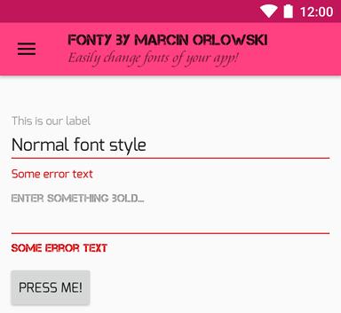

Fonty
=====

 `Fonty` is Android library allowing you to easily change the typeface 
 of your UI elements. Contrary to other implementations `Fonty` is 
 designed with the assumption that if you want to change the font for your
 app, then you change it **globally**, to achieve consistency across your
 Fragments or Activities.
 
 This means that using `Fonty` will require **no change** to your layout files.
 All you need to do is to initialie the library and specify what typeface
 you want to be used for regular text and what for boldfaced ones. That's it.
 
 
 
Installation
============

 Edit your master `gradle.build` file and **add** `maven { url 'https://jitpack.io' }` to your current
 `repositories` block content (if you use other jitpack hosted libraries, then this step can be skipped):

    allprojects {
      repositories {
        maven { url 'https://jitpack.io' }
        }
    }

 Next, edit your **module**'s `build.gradle` and the following dependency:

    compile 'com.github.MarcinOrlowski:fonty:<VERSION>'

 For recent value of `<VERSION>` consult [library releases](https://github.com/MarcinOrlowski/fonty/releases)
 or jitpack badge: 

Usage
=====

 Put your `TTF` font files into module's `asset/fonts` folder, which usually is:
 `<MODULE>/src/main/assets/fonts` folder, where `<MODULE>` equals `app`.
 
 Then add the following lines to your custom Application's class' `onCreate()`
 method (if you do not use own `Application` subclass, see demo app for how
 to make one and how it should be referenced form your `AndroidManifest.xml` file):

    Fonty.init(this)
	    .regularTypeface("Xenotron.ttf")
        .boldTypeface("XPED.ttf");
	}

 The above sets up `Xenotron.ttf` to be used whenever regular font is used (most cases)
 and `XPED.ttf` to be used if your UI elements sets `android:textStyle="bold"` attribute.

 If you prefer to have font files stored elsewhere than in assets' `fonts/` subfolder use `fontDir()`
 in your builder chain: 

    Fonty.init(this)
        .fontDir("my-fonts")
	    .regularTypeface("Xenotron.ttf")
        .boldTypeface("XPED.ttf");
	}

 and put your font files into `<MODULE>/src/main/assets/my-fonts` folder.

 This sets up font sustitution but we still need to apply it. It basically means
 that all you need to do is to call `setFonts()`.
  
 For Activity add this as last entry in your `onCreate()`:
 
    Fonty.setFonts(this);

 For Fragments, add the following in your `onCreateView()`:
 
     Fonty.setfonts(this);
     
 For RecyclerView, add the following to your `onCreateViewHolder()`:
 
     Fonty.setFonts(view);
     
 where `view` means first argument passed to your `onCreateViewHolder()` method.
     
 If you are using DataBinding, the you need to call:
  
     Fonty.setFonts((ViewGroup)binding.getRoot());

 instead.
  
  
https://choosealicense.com/licenses/apache-2.0/
